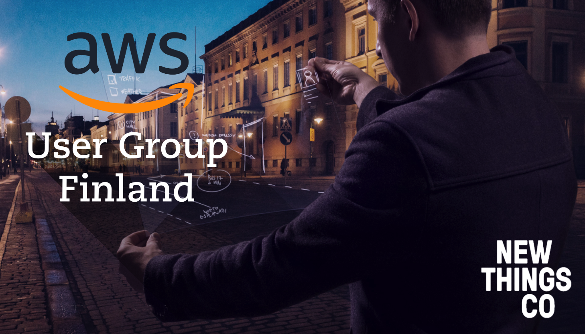

# AWS - Why Bother?
### By Michael Fynes

"In the beginning there was darkness…"

Then Amazon said, "let there be clouds!" and thus the empire was forged.  Cloud services, and the components that make up cloud services, are now rapidly becoming a core part of any developers competencies.  Relying on a specific designated “DevOps”, “Infra”, or “IT Manager”, to handle all the deployment of applications to these cloud services is a luxury most companies can not afford.  This is especially true since most companies have wildly different ideas of what DevOps actually is, in some cases it means developers do everything, in others it means having dedicated team to handle integration of code to infrastructure.  Some companies can, and do, imbue all this knowledge and responsibility on a single person.  This however presents a large risk if that person, or persons, was to ever leave the company.  This brief is aimed at the first definition.  You wrote it, you run it.  Developers who are just starting out with cloud services who want to help reduce this risk, and to improve their own toolbox can use this talk as a gentle introduction of what it is all about.  It contains the information I wish I had access to when I began my own journey out of the swamps and into the clouds.

## Where to begin

I started really learning about developing for the cloud, not with AWS, but with Google Cloud Services.  My first dive into it was through the App Engine standard environment with Google Endpoints as the API mechanism.  The wealth of teaching materials meant it was a gentle introduction but it didn't really answer many of the questions I had.  My search continued, I explored Azure briefly, before landing on Elastic Beanstalk as where I would begin my quest.  The main reason is, possibly, also the worst.  What Elastic Beanstalk does best is not that you can configure large, scalable, dynamic applications with this interface, though it can be done using other methods (more on that later).  What it does best is it collects all the core concepts needed for basic web development and deployment in a single place.  For a beginner, this was a blessing, it meant I did not need to delve through all of 100 or so of the services offered by AWS but could focus on the ones I needed as a web orientated developer to get started.

## Key terms

Before we go further lets define some acronyms and key terms (there are a lot of acronyms in AWS).

EB - Elastic Beanstalk (not to be confused with EBS)

EC2 - Elastic Compute Generation 2, serves as core of all instance based AWS services.

RDS - Relational Database Services, allows you to create instances configured specifically for databases.

VPC - Virtual Private Cloud, allows you to define your own software defined network, possibly one of most powerful features found in any cloud service (they all seem to call it the same thing at least in this instance).

IAM - Identity & Access Management, this is where you will control who can create new applications and services from your own organization, as well as defining what other AWS services your applications can interact with.

Load Balancer - Balanced the load, it splits calls to your service between instances to ensure a single instance does not get overwhelmed.

## Beginning to begin

1. Create your Elastic Beanstalk App by creating first environment

2. Create EC2 Key Pairs and IAM role for application.

3. Change capacity to load balanced

4. Switch to Application load balancer

5. Setup second service and connect the two

6. Profit

Well none of those steps meant anything to me the first time I started so let’s go through this a little bit more slowly.

## Creating your first Beanstalk application

Creating the application itself is actually the easiest (or hardest) part.  Just pick a name!  Once you have gone through your lexicon of greek gods and moved onto the Aztecs and landed on something obscure and easy to pronounce we can make the first critical decision of the Elastic Beanstalk process.  The first environment.  Environments in Elastic Beanstalk act like templates for instances that can be deployed as the demand for that service increases.  Elastic beanstalk environments can come in two flavours, a web environment with a web site or APIs, or a worker environment intended to longer running jobs.  In this example I will focus on the web environment.  Once you have chosen a web environment you must now choose a configuration to start with.There are a variety of pre-configured environments to choose from such as Java, Node.js, Python, or you can simply run a docker container environment, this leaves the details of what and how these are run up to you.  The preconfigured setups for the various languages allow you to use instances that are tuned for a specific setup using Amazon Linux AMI, a distro maintained by AWS to ensure support for the latest EC2 instance types.

## EC2 key pairs and IAM profiles

For anyone familiar with servers, these should be relatively familiar.  EC2 uses these keys to ensure only services and users that should have access to these instances can actually access them, by default there is no EC2 key pair assigned to an environment meaning you cannot remotely access the instances.  These cannot be created from the Elastic Beanstalk menu and oddly enough is not found under the IAM service but in EC2.  There is probably a good, historical reason for this but it took me a while to find it (had to go and read official documentation, such a pain!).  On the left hand side you will find the security tab, and an option called "Virtual Machine Key Pairs" (note they are called EC2 Key Pairs almost everywhere else in AWS), here you can generate a key pair that you can assign to your EB environment.

Next up you will need an IAM instance profile.  This is used by your application to access other services, and other parts of AWS (like DynamoDB for example).  The service profile is generated automatically once you create your first EB environment.

Now that we have a security key pair we can add it to our configuration by opening the Security card back in the Elastic Beanstalk environment configuration.

## Availability presets and server configuration

The easiest way to create a scalable application with the Elastic Beanstalk UI is to select a "High-Availability" preset, this by default will set the “Capacity” to load balanced, increase the maximum number of instances to four, and change from classic load balancer to an application load balancer.  In this example each environment has a spring boot server running on port five thousand.  To make sure we can access our service we take advantage of a spring boot feature which allows us to simply create an environmental variable with the port we want it to run on.  Now we have a server, load balancer, and several instances, we now need to ensure the load balancer is forwarding to the right ports.  This is done under the load balancer tab.

## What this setup is for

This setup, while useful for experimentation and learning is perhaps not best suited to a production application.  The main problem with this approach is all the clicking.  When you manually create these environments and services you will inevitably make mistakes.  In a learning setup like this it is unlikely to cost you anything, but in a larger environment it can be very costly.  Not to mention having to click through hundreds, or dozens of environments, and manually naming them would be a nightmare.  This is why infrastructure as code exists.  It allows you to automate the creation of these environment, as well as version the infrastructure based on the needs of the code (rather than mangling the code to the needs of the infrastructure).  The VPC used is the default AWS VPC, this is a public VPC that all instances are in unless otherwise specified, don't worry no one can see or access your instances that live here, the EC2 security groups make sure of that.  The default VPC is great for experimentation but should not be used for data storage (We want that in a private subnet).  This setup will allow for experimentation and learning, giving you a configuration that you can expand, or reduce in scope without much cost or risk.  It also means that all your services are exposed to the internet, this is fine in this scenario as we don't have anything sensitive on show, but in a real setup you may not want this.

An alternative to this setup would be to work through Lightsail, which appears to be aimed at prototyping and experimentation before moving into the main AWS world.  If I could start again, I would probably begin there.

## The Cloud Native Approach

While I learning about cloud services I saw and heard a lot of mentions of "Cloud Native", what this actually meant however was not always clear.  What I have found after some digging is that the general consensus is that the “Cloud Native” approach can be defined as almost the opposite of the more traditional approach to server deployment.

The "old way" can be characterised by the ideology of “If it ain't broke, don't fix it”, the flaw in our current technological world is that if it is not updated or “fixed” regularly it will eventually be obsolete, or worse, present an even bigger risk later in its life cycle due to security or obsolescence, this is especially visible in older, large corporations that are now struggling to modernise, but are moving into the cloud world (banking, logistics, and other companies relying on ancient mainframes rather than more modern methods as an example).

The cloud native approach is based on the premise of moving quickly, but in small, easily reversible steps.  This is leads you, as a developer, to build services that are small, independent and which serve a singular or at least very specific functionality without being dependent on others, known as being loosely coupled.  Additionally as these services need to be spun up at a moments notice, potentially in any  data center, anywhere in the world it is critical for the services to be stateless, disposable, meaning that the overall impact to service of instance restarting or being removed should be negligible.  And finally the services should be environmentally independent.  This last point is often handled using containerization as it allows you to control the environment your application can access irregardless of the underlying hardware or OS.  To enforce this pattern it is strongly recommended to invest time and effort into a infrastructure as code setup.

## Infrastructure as code

Infrastructure as code allows you to use a configuration file in your code repository to define the structure of your deployment.  This saves lots of clicking, avoids mistakes, and crucially, it allows you to not only automate your deployment but also test it before it goes live.  As it lives in your repository you get a nicely versioned file (or files) allowing you to satisfy the cloud native requirement of a change being reversible, and by plugging this into a continuous integration and deployment system you can deploy the small, reversible changes quickly.

You do not have to build your own luckily as there are many great tools already, one tool that is quickly becoming a standard is Terraform.  Terraform uses HCL, a DSL language which should feel familiar to anyone who has used JSON.  This lets you define almost any part of any of the major cloud providers.  Using Terraform also allows you to use its plan function, which will highlight key differences between the old deployment and the new.

CloudFormation is the AWS "native" way of doing IaC, it uses JSON or YAML to create templates that allow you to provision AWS resources.  There are pre-made templates for common infrastructure setups, such as a “lamp” setup which contains EC2 instances, RDS databases, and a VPC.  It can provision a setup that is simple, or it can go into more depth by using functions to define conditions and other such things (allows separation of production and development setups with a simple parameter passed the CLI for example).

Other popular tools like Ansible allows you to provision your server setup, but will not actually let you define the infrastructure (VPCs, etc).  In some cases this is exactly what is needed as it may be that the main thing that changes in a project is instances.

## VPCs and their setup

VPCs.  Regions.  Availability Zones.  What?  A Virtual Private Cloud (VPC) is simply a network defined purely by software.  Put away your Cisco Switches and CCNA handbooks (actually they might come in handy keep hold of those).  A VPC allows you to make sure only those who should be able to access your instances, can access them.  This goes beyond security groups and allows you to isolate certain functionalities, and data by subnet.  For example, due to the EU's new GDPR law (and as a general best practice) it is now critical to ensure any user data (the most typical Personal data stored) is tightly controlled.  So to make sure that it is controlled you could create setup where the user service sits in its own subnet, with only services that absolutely need user data able to access it.  A separate database with the user data can also live within this subnet, again secured so only certain individuals and/or services can ever access it.  Having this separation makes it much easier to comply with legislation like this, explaining to an EU auditor why your user database lives in a public network with only a simple password securing the data might be a bit difficult.  (hint : most of GDPR is about documenting and proving you have made an effort to meet the requirements, there are no technical requirements in GDPR legislation yet, Finnish regulators expected to take a "help fix problem first" approach rather than slapping big fines on companies).

A multi availability zone VPC can be setup to ensure high availability (HA in the lingo), this makes your setup more robust when faced with, admittedly rare, outages.  Once you have your VPCs and instances configured the way you want to make sure your application has low latency where you customers are.  Rather than moving the instances to a data center nearby you can use CloudFront CDN and its Edge locations.

## It's a wrap

This talk can be summed up as, "You build it, you run it".  When forced to manage the running of an application, it changes the way you build it.  In the cloud universe every second you spend running a function costs money.  This is especially true in the serverless world.  When forced to manage the running of an application you can begin to see new possibilities in the way you structure your applications.  Does an application that serves a UI with content for a web store need to rebuild each store item from an SQL database with every query?  Would a more persistent cache be more useful?  When forced to manage the running of an application you immerse yourself in what’s coming next.  No longer is “the cloud” something someone else deals with, it is something you will work with every day.

## Further Learning

### General cloud tools

* VPCs

* Load balancers

* Docker

* Kubernetes

* Terraform, Ansible

* Serverless

* ELK stack- ElasticSearch, Logstash, Kibana

### AWS

* Explore AWS calculator to tune for your needs

* CloudFront, Route 53 and other domain and routing tools

* EKS - Managed Kubernetes in AWS

* S3 - File storage in AWS

* DynamoDB - NoSQL DB

* SES - Simple Email Service

* Lambda - Serverless functions

* Fargate - Serverless containers

* CloudFormation - AWS Infra as code tool

## Useful links

* AWS Acronyms : [https://geekflare.com/aws-related-acronyms/](https://geekflare.com/aws-related-acronyms/)

* NodeJS tutorial breaking monolith to microservices : [https://aws.amazon.com/getting-started/projects/break-monolith-app-microservices-ecs-docker-ec2/](https://aws.amazon.com/getting-started/projects/break-monolith-app-microservices-ecs-docker-ec2/)

* AWS VPC Basics : [https://www.youtube.com/watch?v=bGDMeD6kOz0](https://www.youtube.com/watch?v=bGDMeD6kOz0)

* AWS VPC docs : [https://docs.aws.amazon.com/vpc/latest/userguide/VPC_Networking.html](https://docs.aws.amazon.com/vpc/latest/userguide/VPC_Networking.html)

* Explanation of Load Balancers : [https://docs.aws.amazon.com/elasticloadbalancing/latest/userguide/how-elastic-load-balancing-works.html](https://docs.aws.amazon.com/elasticloadbalancing/latest/userguide/how-elastic-load-balancing-works.html)  

* Infra as code tools : [https://www.thorntech.com/2018/04/15-infrastructure-as-code-tools/](https://www.thorntech.com/2018/04/15-infrastructure-as-code-tools/)

* CloudFormation snippets : [https://docs.aws.amazon.com/AWSCloudFormation/latest/UserGuide/CHAP_TemplateQuickRef.html](https://docs.aws.amazon.com/AWSCloudFormation/latest/UserGuide/CHAP_TemplateQuickRef.html)

* Terraform modules : [https://registry.terraform.io/](https://registry.terraform.io/)

* Serverless learning:

    * [https://serverless.com/blog](https://serverless.com/blog) - Serverless Framework

    * [https://github.com/awslabs/serverless-application-model](https://github.com/awslabs/serverless-application-model) - AWS SAM

    * [https://d1.awsstatic.com/whitepapers/architecture/AWS-Serverless-Applications-Lens.pdf](https://d1.awsstatic.com/whitepapers/architecture/AWS-Serverless-Applications-Lens.pdf)
